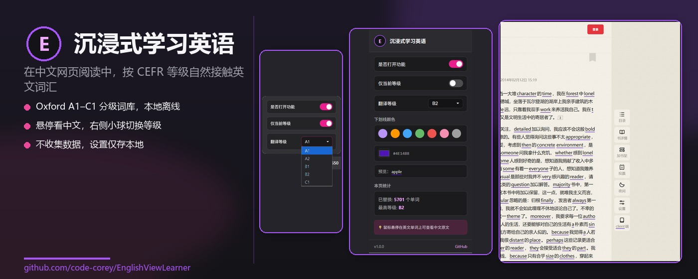
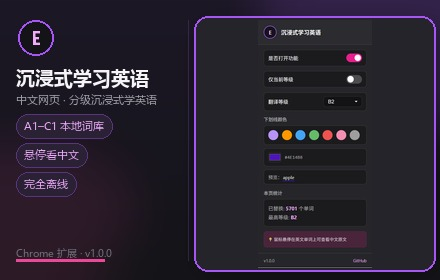
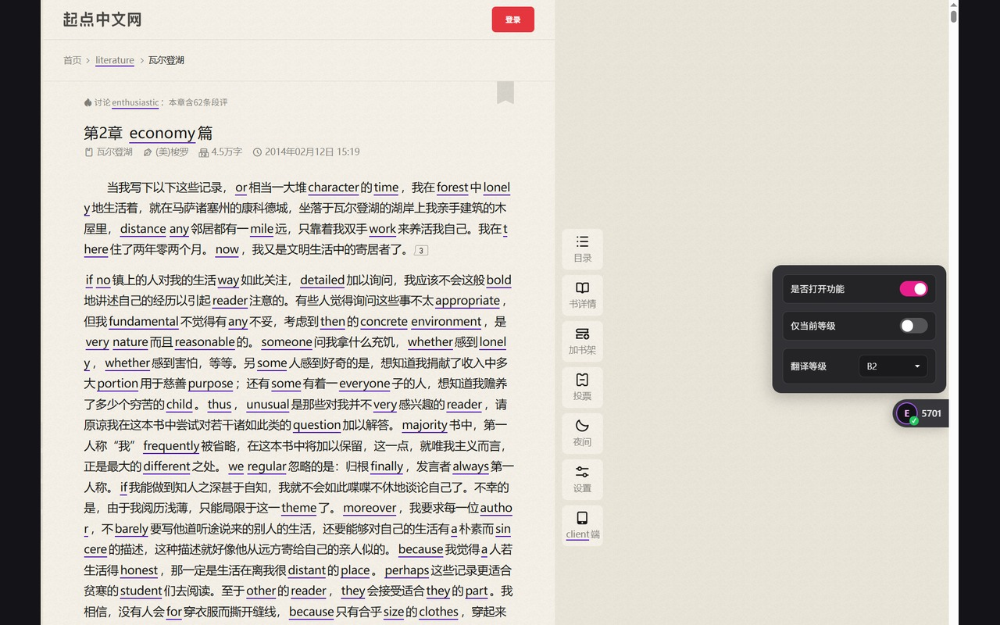
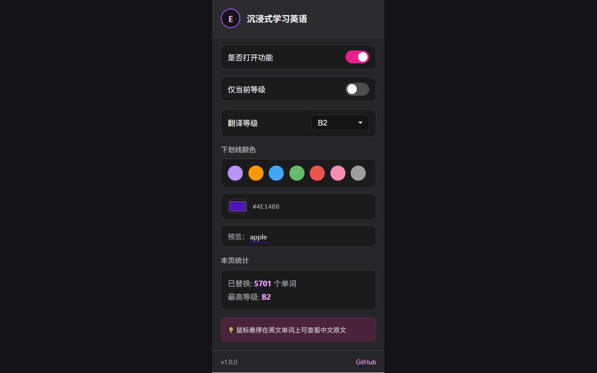
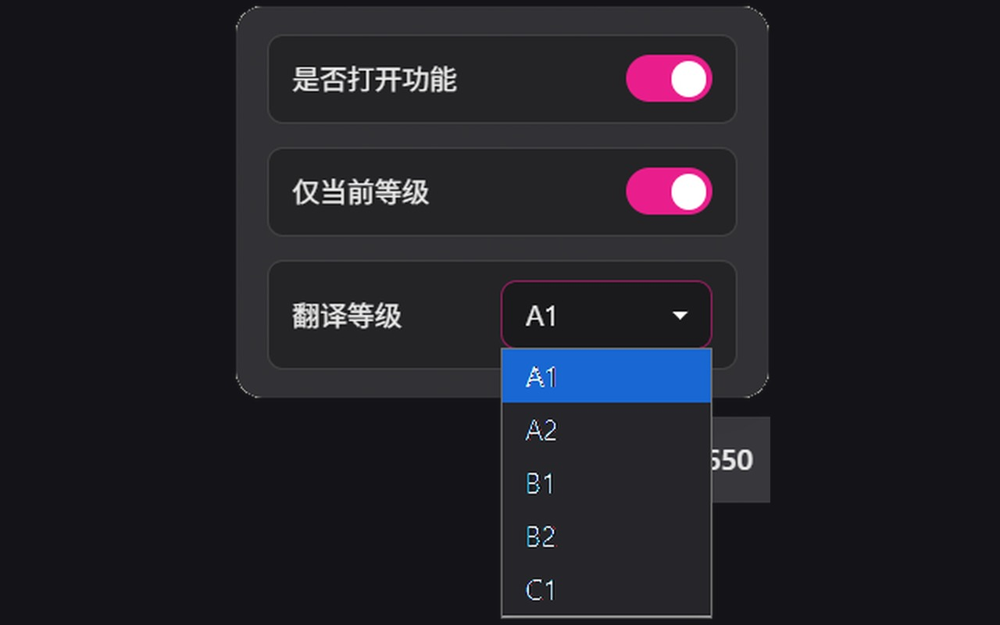

<p align="center">
  
</p>

<h1 align="center">沉浸式学习英语</h1>

<p align="center">
  在中文网页阅读中，按 CEFR 等级自然接触英文词汇 · 本地词库 · 完全离线
</p>

<p align="center">
  <a href="https://github.com/code-corey/EnglishViewLearner">GitHub</a> ·
  <a href="docs/privacy.html">隐私政策</a> ·
  <a href="docs/store-listing.md">商店上架素材</a>
</p>

---

## 预览

### 宣传图

<p align="center">
  
</p>

<p align="center">
  
</p>

### 屏幕截图（1280×800）

| 网页沉浸式替换 | 弹窗设置 | 悬浮抽屉 |
| :---: | :---: | :---: |
|  |  |  |
| 中文页面按等级替换为英文，悬停查看原文 | 等级、开关、下划线颜色、本页统计 | 右侧小球快速切换开关与等级 |

> 以上图片位于 `pic/store/upload/`，可直接用于 [Chrome 网上应用店](https://chrome.google.com/webstore/devconsole) 上传。

---

## 功能

- 中文网页自动分词（`Intl.Segmenter`，Chrome / Edge 原生支持）
- 本地分级词库（约 12 万词条，A1～C1，Oxford 5000 + CC-CEDICT）
- 默认替换**当前等级及以下**词汇；可开启「仅当前等级」
- 自定义下划线颜色；悬停显示中文原文
- 工具栏弹窗 + 右侧**悬浮小球**抽屉，快速切换开关与等级
- 可视区域懒处理 + 动态内容监听；核心功能**完全离线**

## 安装

### 开发者模式（本地加载）

1. 打开 Chrome / Edge 扩展管理页（`chrome://extensions` 或 `edge://extensions`）
2. 开启「开发者模式」
3. 点击「加载已解压的扩展程序」，选择本仓库的 `extension` 目录

### Chrome 网上应用店

正在上架中。打包文件：`dist/immersive-english-v1.0.0.zip`

```powershell
powershell -File scripts/package-store.ps1
```

商店文案、隐私说明与图片素材见 [docs/store-listing.md](docs/store-listing.md)。

## 使用

1. 点击工具栏图标打开弹窗，或点击页面右侧紫色 **E** 悬浮球
2. 选择英语等级（A1～C1，默认 B1）
3. 浏览中文网页，符合条件的词会自动替换为英文
4. 鼠标悬停带下划线的英文，查看中文原文

## 目录结构

```
extension/
├── manifest.json          # Manifest V3
├── background.js          # 词库加载、设置存储
├── content.js             # 分词、查词、替换、悬浮球
├── popup.html / .js / .css
├── injected.css           # 页面内样式
├── icons/                 # 16 / 32 / 48 / 128
├── dict/graded_dict.json  # 分级词库
└── scripts/               # 词库构建、商店图片生成

pic/store/upload/          # Chrome 商店可直接上传的图片
docs/                      # 隐私政策、商店文案
dist/                      # 打包 zip
```

## 构建完整词库

```bash
python extension/scripts/download_oxford.py
python extension/scripts/download_cedict.py
python extension/scripts/merge_dict.py
```

输出：`extension/dict/graded_dict.json`（约 12 万词条，~9 MB）

数据来源： [CC-CEDICT](https://www.mdbg.net/chinese/dictionary?page=cc-cedict)（CC BY-SA 4.0）、[Oxford 5000](https://github.com/nalgeon/words)

## 重新生成商店图片

```powershell
python extension/scripts/generate_promo.py
python extension/scripts/export_store_uploads.py
```

## 技术说明

| 模块 | 说明 |
|------|------|
| 分词 | `Intl.Segmenter('zh-CN', { granularity: 'word' })` |
| 词库 | 内存 JSON，O(1) 精确匹配 |
| 等级 | A1(1) < A2(2) < B1(3) < B2(4) < C1(5) |
| 存储 | `chrome.storage.local`（等级、开关、颜色、仅当前等级） |
| 隐私 | 不收集数据；网页内容不上传服务器 |

## 许可证

词库数据：CC-CEDICT（CC BY-SA 4.0）、Oxford 5000（请遵循其使用条款）。
