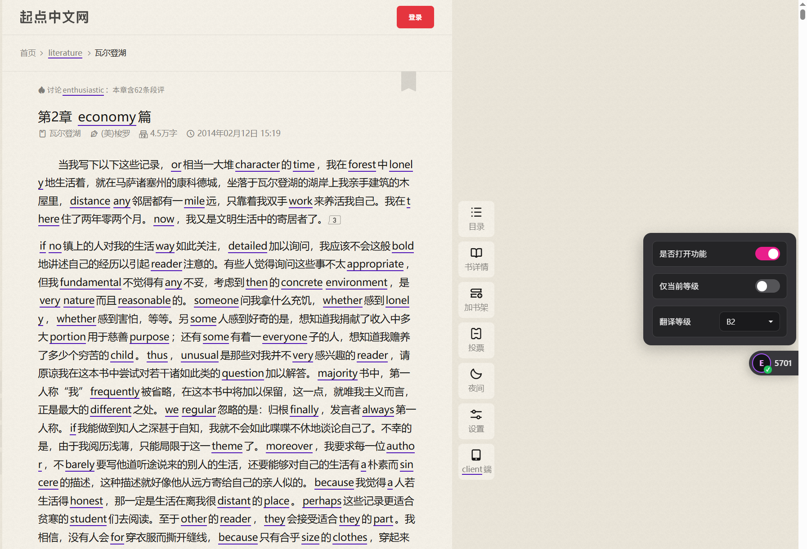
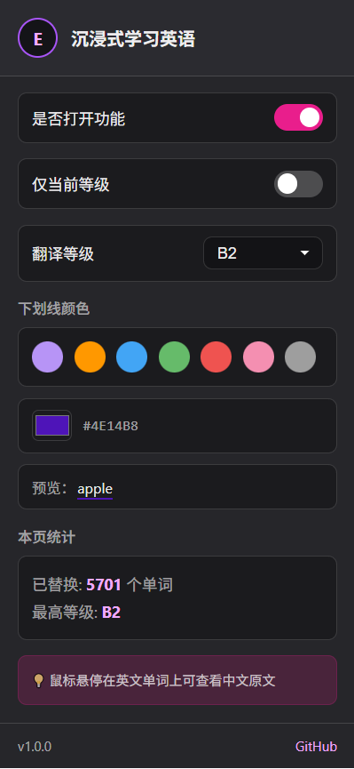
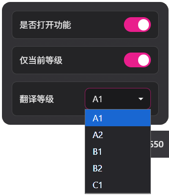
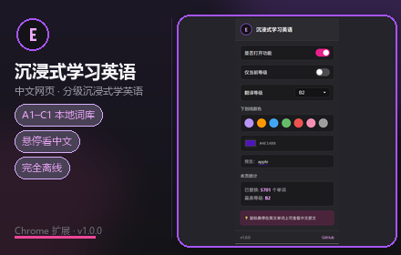
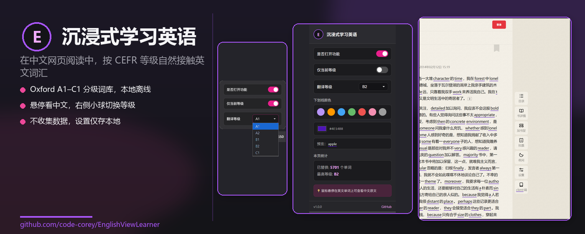

# Chrome 网上应用店 — 上架素材

## 隐私政策 URL

启用 GitHub Pages 后，可使用：

```
https://code-corey.github.io/EnglishViewLearner/privacy.html
```

或在仓库 Settings → Pages 中，将 `/docs` 目录发布为站点，则 URL 为：

```
https://code-corey.github.io/EnglishViewLearner/privacy.html
```

（将 `docs/privacy.html` 复制为 `docs/index.html` 亦可，按需调整。）

本地预览：打开 `docs/privacy.html`

---

## 商店文案（可直接复制）

### 名称
沉浸式学习英语

### 简短说明（≤132 字）
按 CEFR 等级将中文网页词汇替换为英文，本地词库离线可用，悬停查看中文原文。

### 详细说明
沉浸式学习英语是一款帮助英语学习者在浏览中文网页时自然接触英文词汇的 Chrome 扩展。

**主要功能：**
- 自动识别中文网页中的词语，按 Oxford CEFR 等级（A1～C1）替换为英文
- 默认替换当前等级及以下词汇；可开启「仅当前等级」模式
- 内置本地分级词库，核心功能完全离线
- 鼠标悬停已替换单词，查看中文原文
- 右侧悬浮小球快速切换开关与等级
- 可自定义下划线颜色

**适合人群：**
正在学习 A1～C1 词汇、希望在日常阅读中巩固英语的学习者。

**隐私：**
不收集个人数据；设置保存在浏览器本地；网页内容不上传服务器。

**词库来源：**
CC-CEDICT（CC BY-SA 4.0）、Oxford 5000 词表。

**开源：**
https://github.com/code-corey/EnglishViewLearner

### 分类
教育 / Education

### 权限说明（填写审核表单时用）
- `storage`：保存用户等级、开关状态、颜色偏好
- `activeTab`：读取当前页替换统计
- 内容脚本注入所有网页：需在用户访问的中文页面本地分词并替换文本；无数据外传

---

## 截图与宣传图

商店素材位于 `pic/store/`；**可直接上传 Google 商店的文件**在 `pic/store/upload/`。

生成/更新素材：

```powershell
python extension/scripts/generate_promo.py
python extension/scripts/export_store_uploads.py
```

### 上传到 Chrome 网上应用店（对照表单）

| 表单字段 | 上传文件 |
|---------|---------|
| 商店图标 128×128 | `pic/store/upload/store-icon-128x128.png` |
| 屏幕截图 1280×800（1～3 张） | `screenshot-1-page-1280x800.jpg`（网页效果） |
| | `screenshot-2-popup-1280x800.jpg`（弹窗设置） |
| | `screenshot-3-panel-1280x800.jpg`（悬浮抽屉） |
| 小型宣传图块 440×280 | `pic/store/upload/promo-small-440x280.jpg` |
| 顶部宣传图块 1400×560 | `pic/store/upload/promo-marquee-1400x560.jpg` |

均为 **无透明通道** 的 JPEG/PNG，符合商店「24 位 PNG / JPEG」要求。

---

### 商店图标（128×128）


路径：`pic/store/upload/store-icon-128x128.png`

---

### 屏幕截图（1280×800）

**1. 网页替换效果**


路径：`pic/store/upload/screenshot-1-page-1280x800.jpg`

**2. 弹窗设置**


路径：`pic/store/upload/screenshot-2-popup-1280x800.jpg`

**3. 悬浮抽屉**


路径：`pic/store/upload/screenshot-3-panel-1280x800.jpg`

---

### 小型宣传图块（440×280）


路径：`pic/store/upload/promo-small-440x280.jpg`

---

### 顶部宣传图块（1400×560）


路径：`pic/store/upload/promo-marquee-1400x560.jpg`

---

### 源文件（含透明，仅供编辑）

| 文件 | 用途 | 预览 |
|------|------|------|
| `screenshot-1-page.png` | 网页替换效果 |  |
| `screenshot-2-popup.png` | 弹窗设置 |  |
| `screenshot-3-panel.png` | 悬浮抽屉 |  |
| `promo-tile-440x280.png` | 小宣传图 |  |
| `promo-marquee-1400x560.png` | 大宣传图 |  |

---

## 打包上传

```powershell
.\scripts\package-store.ps1
```

生成 `dist/immersive-english-v1.0.0.zip`，上传到
[Chrome 开发者控制台](https://chrome.google.com/webstore/devconsole)。
